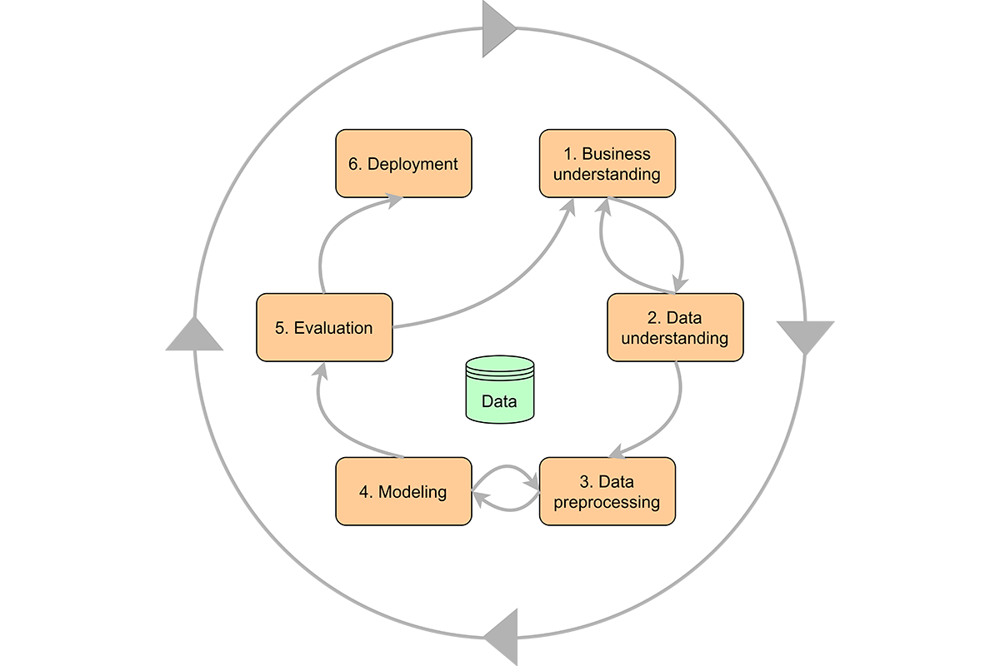

Title: CRISP-DM Series: Mastering Data Mining in Football Analytics
Date: 2024-02-4
Tags: Python,Machine Learning, CRISP, Data Mining, Nima Moradi
Category: Guide
Summary: An example of CRISP-Data Mining using python

Welcome to our CRISP-DM series, where we explore the Cross-Industry Standard Process for Data Mining through the lens of football analytics. This series is designed for aspiring data scientists and analytics enthusiasts who wish to deepen their understanding of data mining processes, from business understanding to deployment, using the exciting world of football as a case study.


## What is CRISP-DM?
The CRISP-DM (Cross-Industry Standard Process for Data Mining) framework offers a structured methodology to navigate data analysts and scientists through the entirety of a project, from inception to completion. Originating from a seminal paper in 2000, its adoption and utility have remained steadfast. Numerous discussions, such as certain articles, attest to its effectiveness in refining the capabilities of data scientists. Its significance extends beyond the technical team, advocating for a comprehensive understanding among all project participants, including stakeholders and managers. For those intrigued by the domain, delving into CRISP-DM is highly recommended as a foundational resource.
## Introduction to CRISP-DM
In this series, we'll dive deep into each phase of the CRISP-DM methodology, applying its principles to football analytics. Our goal is to not only uncover insights into creating the most potent attacking line-up but also to equip you with the skills and knowledge to tackle any data mining project with confidence.


### Defining the Objective (Business Understanding)
Our journey begins with a clear objective for this example
I will use football data to predict the most effective attacking lineup in football teams. This objective will guide our data mining process, 
ensuring that our efforts are aligned with a strategic goal.


### Gathering Data
We leveraged Python's pandas and BS Soup library to programmatically collect data from fbref.com, focusing on key performance metrics like goals, assists, and shots on target.
It can be used on different leagues and seasons In here only showcase English Premier League 2015/16 season data.


#### Extracting Table Data with BeautifulSoup
Before diving into the pandas DataFrame creation, 
it's essential to capture the table data from the webpage.
BeautifulSoup excels in parsing HTML and XML documents,
making it an invaluable tool for web scraping tasks.
Here's how we can use it to pinpoint the table containing our desired data:
```python
from bs4 import BeautifulSoup
import requests

# Fetch the webpage content
url = "https://fbref.com/en/players/002d06bb/matchlogs/2015-2016/Sylvain-Distin-Match-Logs"
response = requests.get(url)
soup = BeautifulSoup(response.text, 'html.parser')

# Locate the table by its tag or class (example shown uses tag)
table = soup.find('table')
```

#### Creating a DataFrame from Table Data
While pandas can directly read tables from HTML pages, 
this method often misses crucial parts of the data, such as links embedded 
in table cells. To overcome this limitation,
we custom-define a function that meticulously extracts both text and hyperlinks 
from each cell, ensuring no data point is overlooked:
```python
import pandas as pd

def dataframe_from_html_table(table):
    # Initialize an empty list to store your data
    # Extract headers
    headers = [header.get_text(strip=True) for header in table.find_all('th')]
    # Initialize an empty list to store your data
    data = []
    # Iterate over the table rows, skipping the header row
    for row in table.find_all('tr')[1:]:
        row_data = {}
        for header, cell in zip(headers, row.find_all(['th', 'td'])):
            # Get text content and hyperlink
            text = cell.get_text(strip=True)
            link = cell.find('a')
            href = link.get('href') if link else None

            # Add text and hyperlink to the row data
            if header == 'Date':
                row_data[header] = text
            elif href:
                row_data[header] = href
            else:
                row_data[header] = text

        data.append(row_data)

    # Create a DataFrame
    return pd.DataFrame(data)
```


To be Continued in Part 2