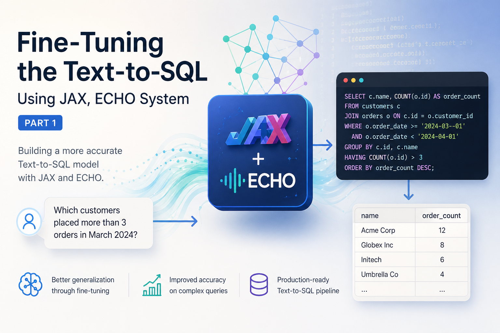

Title: Fine tuning the text to SQL using JAX echo System - Part 1
Date: 2026-04-30
Tags: Python, Nima Moradi, Jax, Applied AI, SQL, LLM
Category: Guide
Summary: Inspecting Our dataset and loading it

# Introduction
In this series, I will use a small LLM model and fine tune it to answer the request by users by creating the right sql query,
I will use Spider1 dataset, this dataset have a ranking and benchmarks for showing the effectiveness of each method, and now have been
replaced with Spider 2, but I will use the older version for our example since it smaller dataset and more established


# Steps
Here is the current plan for this series,
1. show the data structure and load the data using Grain
2. Prompting + tokenization + zero-shot generation
3. LoRA fine-tuning with Tunix
4. SQL fine tune evaluation with examples
5. Execute generated SQL on SQLite and compare results

# Spider dataset

This dataset comes from Spider: A Large-Scale Human-Labeled Dataset for Complex and Cross-Domain Semantic Parsing and Text-to-SQL Task paper from 2018,

Here are some values for you to view for each test/train sample in the Spider dataset. We've shortened the original JSON structure to highlight the most relevant information for human readability.

```json
{
    "db_id": "geo",
    "query": "SELECT city_name FROM city WHERE population  =  ( SELECT MAX ( population ) FROM city WHERE state_name  =  \"wyoming\" ) AND state_name  =  \"wyoming\";",
    "question": "what is the biggest city in wyoming"
}
```

**Explanation of Shortened Parts:**

We've focused on the `db_id`, `query`, and `question` fields, as these are the most directly interpretable for understanding the dataset's core purpose: mapping natural language questions to SQL queries for a specific database.

The following fields were omitted for brevity:

*   `query_toks`: This field contains the tokenized version of the SQL query. While useful for machine processing, it's redundant for human understanding when the `query` field is present.
*   `query_toks_no_value`: Similar to `query_toks`, but with values replaced by a generic "value" token. This is primarily for model training and not for human review.
*   `question_toks`: The tokenized version of the natural language question. Again, the `question` field itself is sufficient for human comprehension.
*   `sql`: This is a highly detailed, nested JSON representation of the SQL query's abstract syntax tree (AST). While crucial for semantic parsing tasks, it's overly complex for a quick human overview of the data samples.

## Grain

Grain is a data loading library in the JAX ecosystem. I wrote this simple data source to read the Spider JSON files, keep only the fields I need, and attach the database schema definition for each record.

```python
class JsonDataSource:
    def __init__(self, json_paths, keep_fields=("db_id", "query", "question")):
        self.records = load_json_files(json_paths)
        self.keep_fields = keep_fields
        self.db_records = {}

    def __len__(self):
        return len(self.records)

    def __getitem__(self, index):
        raw = self.records[index]

        record = {
            key: raw[key]
            for key in self.keep_fields
            if key in raw
        }

        file_path = f'{os.environ[SPIDER_PATH]}/database/{record["db_id"]}/schema.sql'
        if file_path not in self.db_records:
            record["db_definitions"] = "\n".join(get_create_table_blocks(file_path))
            self.db_records[file_path] = record["db_definitions"]
        else:
            record["db_definitions"] = self.db_records[file_path]

        return record
```

After defining the data source, I can pass it to Grain and create a loader. For now, I use the development split, disable shuffling, and set `batch_size=1` so it is easy to inspect one example at a time.

```python
dev_source = JsonDataSource([
    base_path + "dev.json",
])

dev_loader = grain.load(
    dev_source,
    num_epochs=1,
    shuffle=False,
    batch_size=1,
    worker_count=0,
)
```

To inspect one sample from the loader, I can use Python’s `iter` and `next`:

```python
sample = next(iter(dev_loader))
sample
```

Here is what one loaded sample looks like with `batch_size=1`:

```python
{
    "db_id": array(["concert_singer"], dtype="<U14"),
    "query": array(["SELECT count(*) FROM singer"], dtype="<U27"),
    "question": array(["How many singers do we have?"], dtype="<U28"),
    "db_definitions": array([
        '''CREATE TABLE "stadium" (
"Stadium_ID" int,
"Location" text,
"Name" text,
"Capacity" int,
"Highest" int,
"Lowest" int,
"Average" int,
PRIMARY KEY ("Stadium_ID")
);
CREATE TABLE "singer" (
"Singer_ID" int,
"Name" text,
"Country" text,
"Song_Name" text,
"Song_release_year" text,
"Age" int,
"Is_male" bool,
PRIMARY KEY ("Singer_ID")
);
CREATE TABLE "concert" (
"concert_ID" int,
"concert_Name" text,
"Theme" text,
"Stadium_ID" text,
"Year" text,
PRIMARY KEY ("concert_ID"),
FOREIGN KEY ("Stadium_ID") REFERENCES "stadium"("Stadium_ID")
);
CREATE TABLE "singer_in_concert" (
"concert_ID" int,
"Singer_ID" text,
PRIMARY KEY ("concert_ID","Singer_ID"),
FOREIGN KEY ("concert_ID") REFERENCES "concert"("concert_ID"),
FOREIGN KEY ("Singer_ID") REFERENCES "singer"("Singer_ID")
);'''
    ], dtype="<U771"),
}
```
