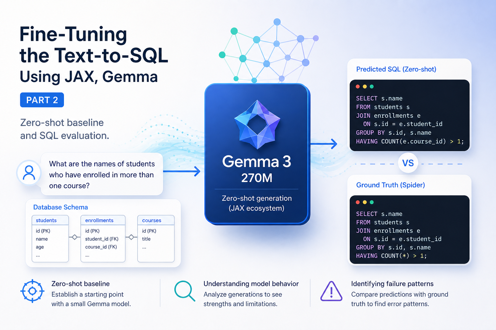

Title: Fine tuning Text-to-SQL using the JAX Ecosystem - Part 2
Date: 2026-05-05
Tags: Python, Nima Moradi, Jax, Applied AI, SQL, LLM, Gemma
Category: Guide
Summary: Loading a small Gemma model, preparing prompts, downloading weights, and running the first zero-shot text-to-SQL baseline

# Introduction

In the previous part, I inspected the Spider dataset and created a Grain data loader that returns the fields I need for text-to-SQL:

1. `db_id`,
1. `question`,
1. `query`,
1. `db_definitions`.


In this part, I use those loaded records to run the first model generation step.

The goal here is not to fine-tune yet. I first want a simple baseline:

1. load a small Gemma model,
1. load the tokenizer,
1. prepare a prompt from the database schema and the user question,
1. run zero-shot generation,
1. compare the generated SQL with the Spider ground truth.

This gives me a starting point before LoRA fine-tuning.

# Why I started with a very small model

Before using Gemma directly, I experimented a little with models from Hugging Face Transformers. That path is very open. It lets you try many model families, including decoder-only models and encoder-decoder models.

But for this series, I want to keep the project close to the JAX ecosystem. The data side already uses JAX-related tools, and the fine-tuning part will also be built around JAX. So I looked at Flax and the Gemma JAX library.

For this part, I selected Gemma 3 270M instruction-tuned. The reason is not that I expect a 270M model to solve Spider perfectly. The reason is that I want something small enough to load, inspect, and fine-tune quickly.

A bigger model will probably handle many of these examples better in zero-shot mode. But the question I want to test in this series is different:

> Can I improve a very small model enough with fine-tuning so it becomes useful for SQL generation?

I do not know the final answer yet. This part only creates the baseline.

# Getting the model weights

The Gemma model architecture can be created from code, but the trained weights must still be downloaded.

For this experiment I used Kaggle to get the Gemma weights. You need to accept the model license first, then authenticate Kaggle in your environment.

I used this setup:

```python
import os

os.environ["XLA_PYTHON_CLIENT_MEM_FRACTION"] = "1.0"

# This will prompt you to enter your Kaggle API token.
import kagglehub
kagglehub.login()
```

After login, I downloaded the model with:

```python
path = kagglehub.model_download("google/gemma-3/flax/gemma-3-270m-it")
print(path)
```

You can also download the weights from the Kaggle UI directly or use a command-line download option. You can learn more about them on the kaggle gemma 3 page.

I used Gemma 3 for this run. Gemma 4 exists, but when I started wiring this project, I wanted to avoid adding another moving target since most of this repo is still under active development, so I stayed with `gemma-3-270m-it` for this part.

# Factory pattern for model loading

I wanted to avoid hard-coding one model in the main training script. Today I am using Gemma 3 270M, but later I may want to try another Gemma size, another tokenizer, or another model-loading path.

For that reason, I created a small factory around the model-loading code.

The configuration contains the parts that may change:

```python
config = LLMFactoryConfig(
    ckpt_path=ckpt_path,
    tokenizer_path=tokenizer_path,
    model_cls=gm.nn.Gemma3_270M,
    tokenizer_cls=gm.text.Gemma3Tokenizer,
)
```

Then the model is built with:

```python
factory = LLMModuleFactory(config)
modules = factory.build()
```

The factory has one main job: return a small group of objects that the rest of the code can use.

The build process is:

1. create the model architecture,
1. load the model parameters from the checkpoint,
1. initialize the tokenizer,
1. create a sampler for text generation.

A simplified version looks like this:

```python
class LLMModuleFactory:
    def __init__(self, config: LLMFactoryConfig):
        self.config = config

    def build(self):
        model = self.config.model_cls()

        params = load_params(self.config.ckpt_path)

        tokenizer = self.config.tokenizer_cls(
            self.config.tokenizer_path,
        )

        sampler = gm.text.Sampler(
            model=model,
            params=params,
            tokenizer=tokenizer,
        )

        return LLMModules(
            model=model,
            params=params,
            tokenizer=tokenizer,
            sampler=sampler,
        )
```

This is only the structure. The exact implementation can change, but the idea is the same: the rest of the project should not need to know all the details of checkpoint loading.

# Tokenization

The model does not read normal Python strings directly. It reads token ids.

I looked at the Gemma tokenizer methods for encoding and decoding text. The tokenizer gives methods to encode a string into tokens and decode tokens back into text. That is useful for debugging because I can inspect what the model receives and what the generated ids become after decoding.

A small check can look like this:

```python
tokenizer = modules.tokenizer

text = "How many singers do we have?"
token_ids = tokenizer.encode(text)

print(token_ids)
print(tokenizer.decode(token_ids))
```

For this part, I kept tokenization simple. I did not yet build the full training tokenization pipeline with masks, labels, padding, and end-of-sequence handling, the sampler will handle this for us.

That will matter more in the fine-tuning part.

# Prompt format

The prompt uses two fields from the Spider example:

1. the database schema,
1. the natural language question.

The target SQL query is not included in the prompt during zero-shot generation. It is only used later for comparison.

The prompt follow this pattern:

```python
f"""<start_of_turn>user
Based on this database schema:

{record["db_definitions"]}

Write a SQL query to answer this question. Output ONLY the SQL query, nothing else.

Question: {record["question"]}<end_of_turn>
<start_of_turn>model
"""
```

This prompt is intentionally direct. I tell the model to output only SQL because I want the result to be easy to compare and later execute.

In practice, the model still sometimes returns Markdown code blocks, such as:

````text
```sql
SELECT COUNT(*) FROM singer;
```<end_of_turn>
````

This means I will need a cleanup step before real evaluation.

# Running zero-shot generation

After the model is loaded and the data loader is ready, the main script calls an evaluation function:

```python
modules = factory.build()

evaluate_text_to_sql(
    sampler=modules.sampler,
    loader=dev_loader,
    max_new_tokens=128,
    temperature=0.0,
)
```

I used `temperature=0.0` because I want deterministic output during debugging. If the output changes every run, it becomes harder to compare prompt changes and model changes.

# First zero-shot results

Here are the first 10 examples from the `concert_singer` database.

I manually checked the generated SQL from these examples. The model did not behave randomly. It handled a few simple patterns well, but it also failed on several examples where it had to understand filters, selected columns, or ordering logic more carefully.

# Good examples

The model did well on the direct counting example:

```text
Question:
What is the total number of singers?

Ground Truth:
SELECT count(*) FROM singer

Predicted:
SELECT COUNT(*) FROM singer;
```

This is the kind of pattern I expected the model to know already: use the `singer` table and count the rows.

It also did well on this ordering example:

```text
Question:
Show name, country, age for all singers ordered by age from the oldest to the youngest.

Ground Truth:
SELECT name ,  country ,  age FROM singer ORDER BY age DESC

Predicted:
SELECT
    singer.Name,
    singer.Country,
    singer.Age
FROM
    singer
ORDER BY
    age DESC;
```

The model selected the right fields from the right table and used descending order for age.

The model also handled the distinct-country examples well:

```text
Question:
What are all distinct countries where singers above age 20 are from?

Ground Truth:
SELECT DISTINCT country FROM singer WHERE age  >  20

Predicted:
SELECT DISTINCT country
FROM "singer"
WHERE age > 20;
```

And similarly:

```text
Question:
What are  the different countries with singers above age 20?

Ground Truth:
SELECT DISTINCT country FROM singer WHERE age  >  20

Predicted:
SELECT DISTINCT Country
FROM "singer"
WHERE Age > 20;
```

These examples are encouraging because the model found the table, the `DISTINCT` operation, and the age filter.

# Failed examples

Some other outputs were clearly wrong.

For the first count example, the model added a filter that should not be there:

```text
Question:
How many singers do we have?

Ground Truth:
SELECT count(*) FROM singer

Predicted:
SELECT COUNT(*)
FROM singer
WHERE Singer_ID = 1;
```

The model understood that it needed `COUNT(*)`, but `WHERE Singer_ID = 1` changes the meaning. The question asks for all singers, not one specific singer.

For this example, the model invented a column name and did not return all requested fields:

```text
Question:
What are the names, countries, and ages for every singer in descending order of age?

Ground Truth:
SELECT name ,  country ,  age FROM singer ORDER BY age DESC

Predicted:
SELECT DISTINCT "Singer_Name"
FROM "singer"
ORDER BY age DESC;
```

There is no `"Singer_Name"` column in the schema. The expected fields are `Name`, `Country`, and `Age`.

The aggregation examples were also weak:

```text
Question:
What is the average, minimum, and maximum age of all singers from France?

Ground Truth:
SELECT avg(age) ,  min(age) ,  max(age) FROM singer WHERE country  =  'France'

Predicted:
SELECT
    singer.Singer_ID,
    AVG(singer.Age) AS AverageAge,
    MIN(singer.Age) AS MinimumAge,
    MAX(singer.Age) AS MaximumAge
FROM
    singer AS singer
GROUP BY
    singer.Singer_ID;
```

The model used the aggregate functions, but it missed the France condition and added `GROUP BY singer.Singer_ID`. That changes the query from one aggregate result for French singers into one aggregate row per singer.

The second France example had a similar problem:

```text
Question:
What is the average, minimum, and maximum age for all French singers?

Ground Truth:
SELECT avg(age) ,  min(age) ,  max(age) FROM singer WHERE country  =  'France'

Predicted:
SELECT
    singer.Singer_ID,
    AVG(singer.Age) AS AverageAge,
    MIN(singer.Age) AS MinimumAge,
    MAX(singer.Age) AS MaximumAge
FROM
    singer AS singer
GROUP BY
    singer.Singer_ID
ORDER BY
    AverageAge DESC
LIMIT 10;
```

Again, the model missed the country filter and added extra operations that were not requested.

The youngest-singer examples also failed:

```text
Question:
Show the name and the release year of the song by the youngest singer.

Ground Truth:
SELECT song_name ,  song_release_year FROM singer ORDER BY age LIMIT 1

Predicted:
SELECT "Singer_ID", "Name"
FROM "singer"
WHERE "Age" = 1;
```

The model should have selected `Song_Name` and `Song_release_year`, then ordered by `Age` and used `LIMIT 1`. Instead, it selected different columns and assumed the youngest singer has `Age = 1`.

The next version was also wrong:

```text
Question:
What are the names and release years for all the songs of the youngest singer?

Ground Truth:
SELECT song_name ,  song_release_year FROM singer ORDER BY age LIMIT 1

Predicted:
SELECT DISTINCT "Name"
FROM "singer_in_concert";
```

This output used the wrong table and did not return the requested song name and release year.

# Result summary

Here is the manual review of the first 10 examples.

| Sample | Question type | Result | What happened |
|---:|---|---|---|
| 1 | Count singers | Failed | Added `WHERE Singer_ID = 1` |
| 2 | Count singers | Good | Used `COUNT(*)` on the `singer` table |
| 3 | Select name, country, age ordered by age | Good | Selected the right fields and used `ORDER BY age DESC` |
| 4 | Select name, country, age ordered by age | Failed | Invented `Singer_Name` and missed `Country` and `Age` |
| 5 | Aggregate ages for France | Failed | Missed `WHERE country = 'France'` and grouped by singer |
| 6 | Aggregate ages for French singers | Failed | Missed the France filter and added extra ordering and limit |
| 7 | Youngest singer song info | Failed | Selected wrong columns and used `Age = 1` |
| 8 | Youngest singer song info | Failed | Used the wrong table and selected the wrong field |
| 9 | Distinct countries where age > 20 | Good | Used `DISTINCT`, the `singer` table, and the age filter |
| 10 | Distinct countries where age > 20 | Good | Used `DISTINCT`, the `singer` table, and the age filter |

This is a useful baseline. The model already knows some SQL structure, especially simple aggregation, ordering, and filtering patterns. But it is not reliable for this task yet.

The most common mistakes in these examples are:

1. inventing columns,
1. missing filters,
1. adding unnecessary `GROUP BY`,
1. adding unnecessary `LIMIT`,
1. selecting the wrong fields,
1. misunderstanding phrases like "youngest singer".

These are exactly the types of errors I want to reduce with fine-tuning.