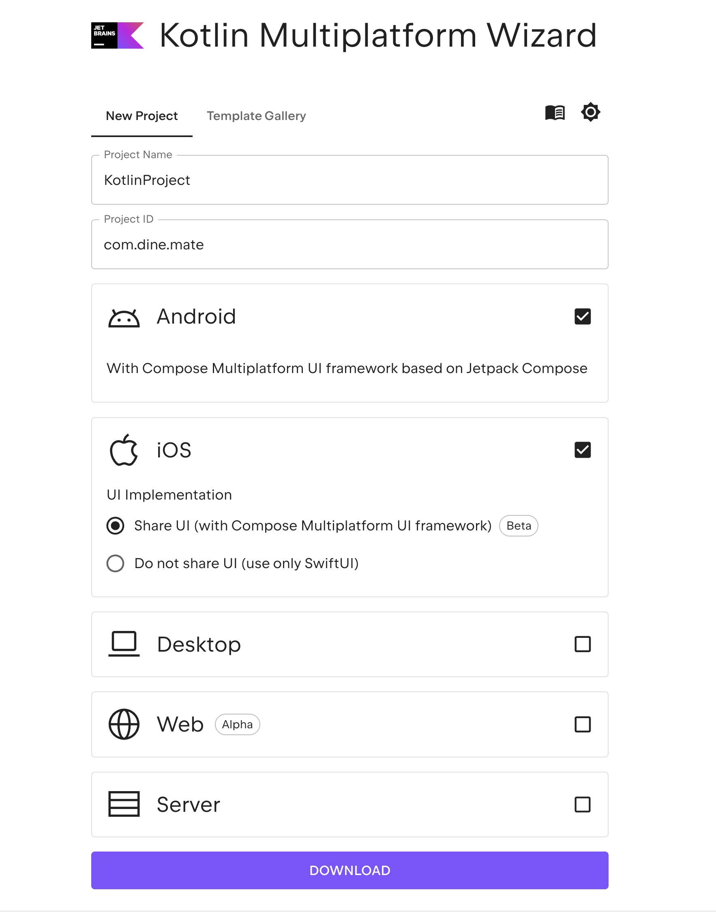
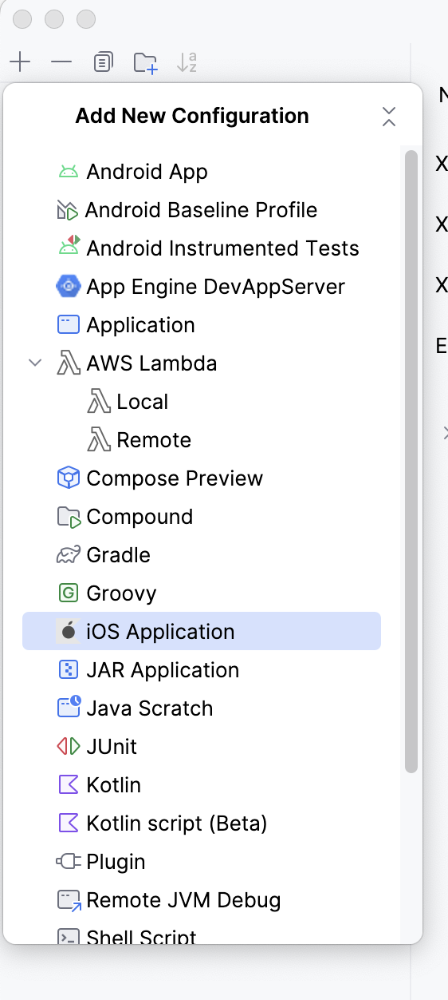

Title: Kotlin Multiplatform Quick Start Guide (macOS)
Date: 2025-04-14
Tags: kotlin, multiplatform, android, ios, compose, jetbrains
Description: A concise guide to setting up and running a Kotlin Multiplatform project on macOS with Android and iOS targets

# Getting Started with Kotlin Multiplatform on macOS

This guide provides the necessary steps to set up a Kotlin Multiplatform (KMP) project targeting Android and iOS using macOS.

## System Requirements

- macOS (latest stable version recommended)
- [Android Studio](https://developer.android.com/studio)
- Xcode (available on the Mac App Store)
- Kotlin Multiplatform Plugin for Android Studio

To install the KMP plugin:
Open Android Studio → `Preferences` → `Plugins` → search for **Kotlin Multiplatform**.  
**Note:** The search is case-sensitive and must be exact.

## Project Creation

You can create the project using one of the following options:

### Option 1: [JetBrains KMP Project Wizard](https://kmp.jetbrains.com/?_gl=1*1jbzjo6*_gcl_au*MTU5NDg3NjQ0LjE3NDQ2NTI2Mzc.*FPAU*MTU5NDg3NjQ0LjE3NDQ2NTI2Mzc.*_ga*MTgzNDc1MTI4OC4xNzQ0NjUyNjM2*_ga_9J976DJZ68*MTc0NDY1Nzg1OS4yLjEuMTc0NDY1OTc2NC41NS4wLjA.)

- Opens an online wizard to generate the project.
- Supports Android, iOS, Desktop, and Web.
- Allows more flexible configuration options.



### Option 2: Android Studio

- File → New Project → **Kotlin Multiplatform Application**
- Select Android and iOS targets

  
*If you do not see the iOS option, install the `Kotlin Multiplatform` plugin or update Android Studio and Xcode.*

## Running the Project

After generating the project:

1. Open the project in Android Studio.
2. Run the Android version using the `composeApp` configuration.
3. To run the iOS version:
   - Create a new Run Configuration → `+` → iOS Application.
   - Set the configuration file to: `iosApp/Configuration/Config.xcconfig`
   - Alternatively, open the `iosApp` directory in Xcode and build/run from there.

You must have Xcode open while building or running the iOS app.

## Project Structure

A simplified overview of the directory layout:

```
.
├── composeApp/                # Shared and platform-specific Kotlin code
│   ├── androidMain/           # Android source set
│   ├── iosMain/               # iOS source set
│   └── commonMain/            # Shared business logic and UI
│       └── composeResources/  # Shared Compose resources
├── iosApp/                    # Swift-based iOS app project for Xcode
│   └── Configuration/         # Contains Config.xcconfig for builds
├── build.gradle.kts           # Root Gradle build configuration
├── settings.gradle.kts        # Gradle settings
├── gradle/                    # Gradle wrapper and versions info
```

_Android and iOS resource/image files are omitted for brevity._

## Next Steps

This setup provides the foundation for multiplatform development. In the next guide, we’ll explore writing shared UI logic using Jetpack Compose and handling platform-specific integrations.

