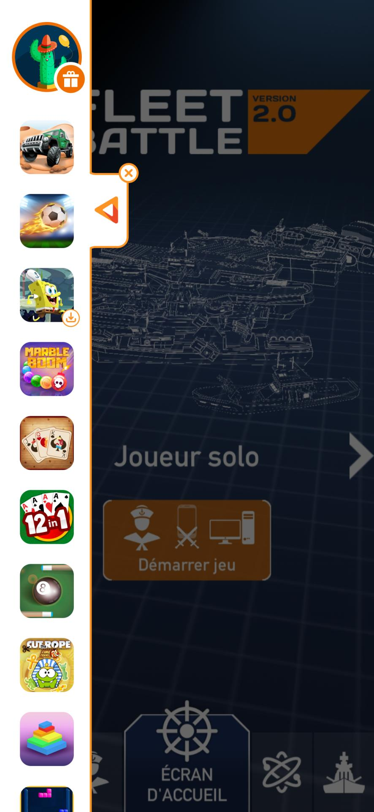
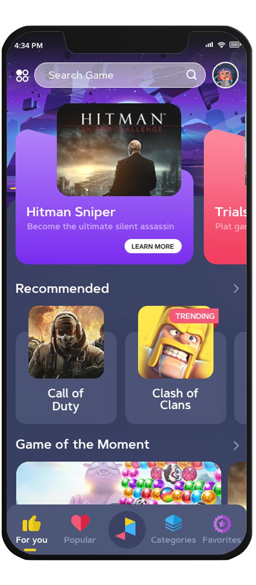
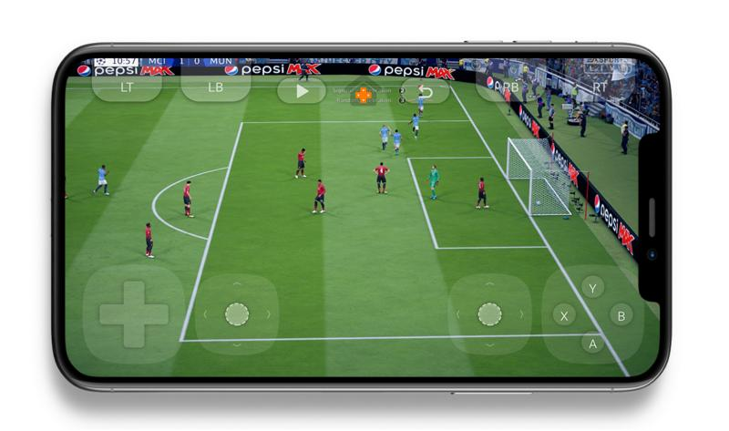
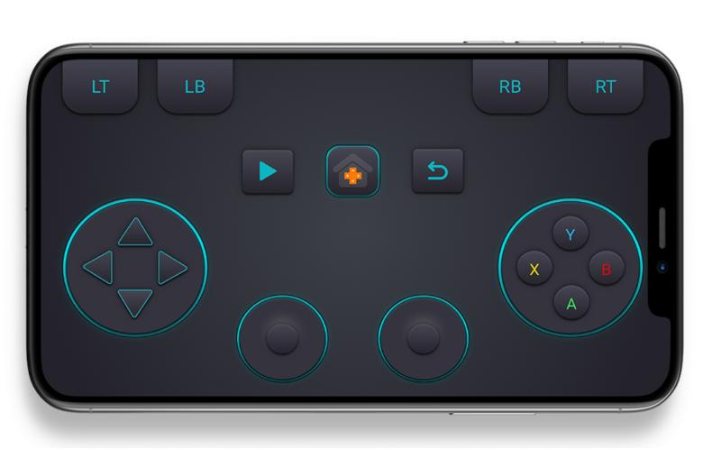

Title: About me
Date: 2023-12-24
Tags: software, AI, bio, Nima Moradi, CV
Description: description of me

# Experience

## Inagral
**Freelance · 2 yrs 2 mos**  
_Sherbrooke, Quebec, Canada · Remote_

#### Financial LLM Market Analysis Tool - Developer
_Apr 2023 - Present · 9 mos_  
Development of multiple news data pipelines, pre-processing, prompt generation and continuous fine-tuning of an LLM on Financial news to extract market trends and sentiment on specific asset classes.

_Skills:_ Llama · Prompt Engineering · BERT (Language Model) · Large Language Models (LLM) · Sentiment Analysis · Python (Programming Language)

### Android DRM Wrapper - Developer
_Nov 2021 - Present · 2 yrs 2 mos_  
Development of an app wrapping platform, adding an Android DRM layer (subscription checking, lateral menu overlay, analytics) to any application by injecting Android smali code to an already compiled Android app.  
_Tech stack:_ Kotlin, Java, Python, Node.js REST API, Android Dynamic Layout generation, Android Dynamic code loading

### Blockchain Data Analysis Tool - Developer
_Jan 2023 - Apr 2023 · 4 mos_  
Development of on an on-chain analysis tool on the Ethereum blockchain using QuickNode and Python to identify early market anomalies.

_Skills:_ QuickNode · Ethereum Blockchain · Smart Contracts · Solidity · Python (Programming Language)

### Android Mobile Cloud Gaming - Developer
_Dec 2021 - Sep 2022 · 10 mos_
- **Responsibilities and Achievements:**
  - Implemented an Android Cloud Gaming architecture using WebRTC.
  - Developed an Android Streamer SDK.
  - Developed an Android System signed controller app.
  - Customized AOSP for input injection from stream.
  - Tech stack: Kotlin, Java, WebRTC, AOSP, WebRTC signaling, WebSocket API, STUN/TURN
- **Skills:** WebSocket, REST APIs, AOSP, WebRTC, AWS Lambda, Cloud Gaming, Android Development
- 

### Android Virtual Gamepad Development

_Jan 2022 - Mar 2022 · 3 mos_
- **Responsibilities and Achievements:**
  - Developed an Android Virtual Gamepad with user-customizable layout in both full-screen and overlay mode.
  - Implemented Physical Bluetooth Gamepad synchronization.
  - Tech stack: Kotlin, Java
- **Skills:** Kotlin, GamePad, Android Development, Java
- 
- 

## Full-stack Developer
_Freelance · Jun 2019 - Aug 2021 · 2 yrs 3 mos_  
_Remote_  
Software Development for various local clients and hobby projects:  
- Grocery Shopping Android app.  
- School Management System web app.  
- Fresh Fruit Shopping and Delivery Android app.  
- Puzzle Game Android app.  
- Open Source Telegram Android app customisation.  
_Tech stack:_ Android, Python Backend, PHP Laravel, Java, Kotlin.

## Sedabook
**Android Developer**  
_Sedabook · Self-employed_  
_Sep 2019 - Nov 2019 · 3 mos_  
Hobby Project working on SedaBook (an online Audiobook marketplace)  
Obtained 2nd place at Sharif University Mobile Development Competition 2019.

_Skills:_ Android Development · Mobile Application Development

## Baghalimoon
**Cross Platform Mobile Developer**  
_Baghalimoon · Freelance_  
_Sep 2017 - Oct 2018 · 1 yr 2 mos_  
_Razavi Khorasan Province, Iran · On-site_  
Development of a Cross-platform React Native app for an Online Grocery Store on Android and iOS used by thousands of users.  
Freelance work for a local StartUp.

_Skills:_ React Native · Mobile Application Development

[Baghalimoon](https://baghalimoon.ir/)

## EDUCATION

### Master of Science
**Bishop's University**  
*MSc Computer Science*  
2021 - 2023  
Thesis: Time-Series Forecasting of ECG and EOG Artifacts in EEG Recordings Using Attention-Based Mechanisms

### Bachelor of Engineering
**Ferdowsi University**  
*BSc Computer Engineering*  
2015 - 2019  
Thesis: Persian text-to-speech using Tacotron 2 and Grapheme-to-Phoneme conversion.  
Project: Autism Detection: LDA for topic modeling and Random Forest for autism detection through Twitter analysis.