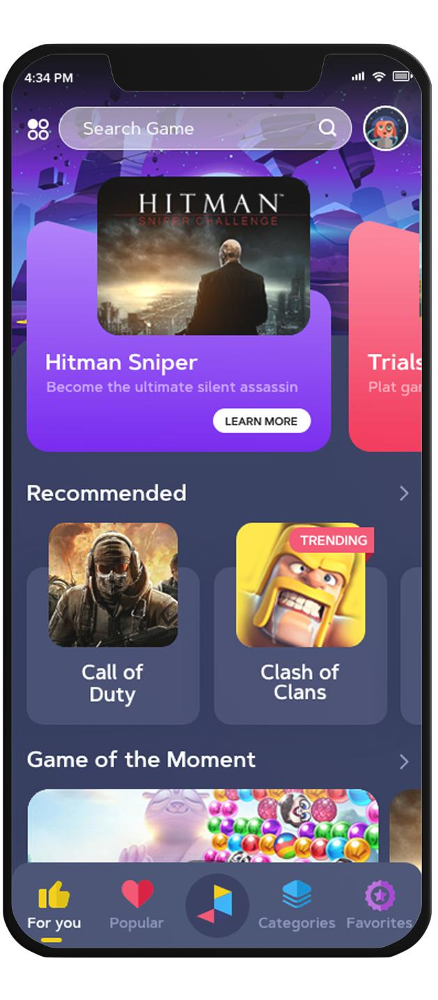
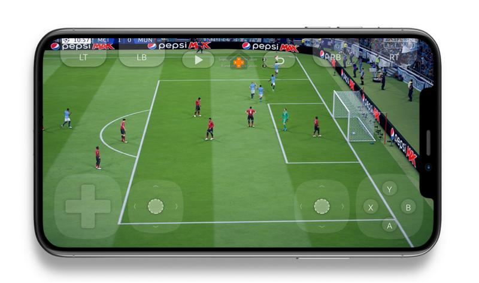
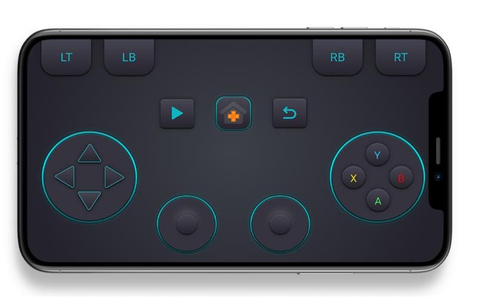
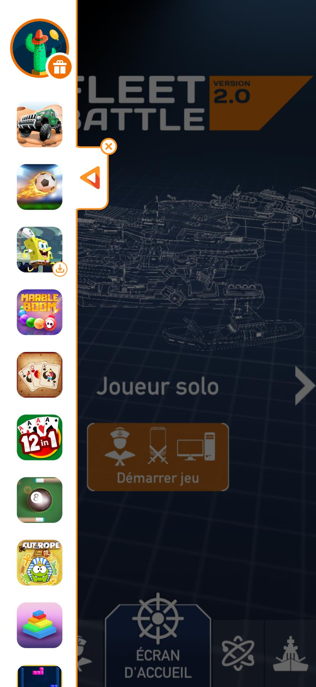

Title: About me
Date: 2026-03-18
Tags: software, AI, Android, cloud, backend, distributed systems, bio, Nima Moradi, CV
Description: Software engineer with 6+ years of experience across distributed backend systems, Android, cloud infrastructure, and AI.

I am a software engineer with 6+ years of experience across distributed backend systems, AWS serverless architecture, Android engineering, WebRTC-based real-time systems, APK instrumentation, and AI/data tooling. My work spans backend infrastructure, mobile platforms, cloud gaming, and developer tooling.

**Location:** Montréal, QC, Canada
**Profiles:** [GitHub](https://github.com/nimamoradi) · [LinkedIn](https://www.linkedin.com/in/nima-moradi/)
**Languages:** English (native or bilingual) · French (elementary)

# Experience

## Inagral
**Software Engineer**
_Remote · Canada · Nov 2021 - Feb 2026

Worked across Android cloud gaming, AWS serverless backends, real-time streaming infrastructure, APK instrumentation / DRM tooling, monitoring, telemetry, and internal AI/data projects.

### Serverless Virtual Device Orchestration Control Plane
Built a serverless control plane for pools of containerized Android and virtual devices used in session-based workloads.

- Architected a hybrid ECS/Fargate + AWS Lambda system for low-latency routing and asynchronous lifecycle management.
- Implemented dynamic pool provisioning and reconciliation using SQS, DynamoDB, and EventBridge.
- Achieved **30%–50% compute savings** through precise warm-pool provisioning and automated teardown.

_Tech stack:_ Python, FastAPI, AWS Lambda, ECS/Fargate, SQS, DynamoDB, EventBridge, SAM, ALB, VPC Networking

### Serverless Signaling Service for Session Negotiation and State Sync
Designed a scalable AWS-based signaling and real-time synchronization layer for cloud gaming sessions.

- Built WebRTC session negotiation and state synchronization services with AWS Lambda, DynamoDB, and WebSocket APIs.
- Helped migrate from a legacy EC2-based setup to a more cost-effective serverless model.
- Reduced operational cost by **roughly 70%–80%**.

_Tech stack:_ Node.js, Python, AWS Lambda, DynamoDB, WebSocket APIs, WebRTC

### Distributed Streaming Platform and WebRTC Media Server
Worked on low-latency media and infrastructure for cloud gaming and real-time streaming.

- Built distributed streaming components on AWS EC2 with Auto Scaling Groups.
- Developed C++ WebRTC media server components using GStreamer.
- Supported automated recovery and stable low-latency video delivery.

_Tech stack:_ C++, WebRTC, GStreamer, AWS EC2, Auto Scaling Groups

### Android Cloud Gaming Runtime / Streamer SDK / Controller / AOSP Customization
Built Android runtime and platform components for cloud gaming.

- Implemented an Android cloud gaming architecture using WebRTC.
- Developed an Android Streamer SDK and a system-signed controller app.
- Customized AOSP for input injection from stream and worked on streaming and recording-related components.

_Tech stack:_ Kotlin, Java, WebRTC, AOSP, REST APIs, WebSocket API, STUN/TURN

### Android Cloud Gaming Storefront / Game Library / Subscription Flows
Developed and optimized the native Android client and storefront experience for a cloud gaming service.

- Re-architected game store UI and subscription flows.
- Improved navigation, engagement, and reduced unnecessary client-side data fetching.
- Mentored a junior developer during client-side architecture updates.
- Improved startup and load time by **about 20%**.

_Tech stack:_ Kotlin, Java, Android UI/UX, client architecture

### Android Virtual Gamepad
Built an Android virtual gamepad for cloud gaming use cases.

- Supported both full-screen and overlay modes.
- Implemented customizable layouts, drag-and-drop controls, layout presets, and Bluetooth gamepad synchronization.

_Tech stack:_ Kotlin, Java, Android, Bluetooth, custom views, input handling

### Android DRM & RASP Security Wrapper / APK Instrumentation Pipeline
Built a wrapper and automation pipeline that modifies compiled Android APKs without source-code access.

- Injected DRM, subscription validation, analytics, monetization, and security-related behavior into target apps.
- Automated manifest merging, resource merging, and resource ID repair across decompiled APKs.
- Implemented dynamic code loading and wrapper-side protections for Android applications.
- Added a lateral overlay and side-menu system to surface native and HTML-based apps inside wrapped applications.

_Tech stack:_ Python, Kotlin, Java, Smali, apktool, DexClassLoader, Android resource and manifest tooling

### Financial LLM Market Analysis Tool
Built financial news and sentiment analysis pipelines around LLM workflows.

- Developed multiple news data pipelines, preprocessing flows, and prompt generation workflows.
- Fine-tuned and continuously adapted LLM-based workflows to extract market trends and sentiment for specific asset classes.

_Tech stack:_ Python, Llama, BERT, Prompt Engineering, Large Language Models (LLM), Sentiment Analysis

### Blockchain Data Analysis Tool
Built an on-chain analysis tool focused on Ethereum market anomalies.

- Used blockchain transaction data and APIs to identify early market anomalies.

_Tech stack:_ Python, QuickNode, Ethereum, Smart Contracts, Solidity

## Freelance
**Full-stack Developer**
_Remote · Jun 2019 - Aug 2021_

Part-time freelance work during my studies across local clients and hobby projects. Some client work is not listed publicly due to NDA.

Representative public work:
- School management system web app
- Grocery shopping mobile app
- Fresh fruit shopping and delivery Android app
- Puzzle game Android app
- Open-source Telegram Android app customization

_Tech stack:_ Android, Python backend, PHP / Laravel, Java, Kotlin, PostgreSQL, MySQL

## SedaBook
**Android Developer**
_Self-employed · Sep 2019 - Nov 2019_

Worked on SedaBook, an online audiobook marketplace. Earned **2nd place** at Sharif University Mobile Development Competition 2019.

## Baghalimoon
**Cross-Platform Mobile Developer**
_Freelance · Mashhad, Iran · Sep 2017 - Oct 2018_

Built a cross-platform React Native app for an online grocery store on Android and iOS.

- Implemented authentication, catalog, cart, checkout, and payment flows.
- Reached a couple thousand installs across Android and iOS, with active users in the hundreds.

_Tech stack:_ React Native, mobile commerce

[Baghalimoon](https://baghalimoon.ir/)

## Mashhad Wheel Manufacturing Co.
**Software Engineer Intern**
_Mashhad, Iran · Jul 2018 - Sep 2018_

Built an intranet communication chat application proof of concept.

- Developed an Android client integrated with .NET APIs.
- Delivered an MVP for internal communication workflows.

# Selected Open-Source & Public Work

### JobFinder
Job finder and CV creator built as a serverless application.
_Stack:_ SerpApi, Google Gemini, AWS SAM, EventBridge, SQS, DynamoDB, SES, Python
[Repository](https://github.com/nimamoradi/JobFinder)

### LLM-Tools
Public repository for building tools for LLMs with LangGraph and Pydantic.
[Repository](https://github.com/nimamoradi/LLM-Tools)

### LLM-Extension
Python project for extending an LLM with a custom functionality layer using LLaMA 3 and Ollama.
[Repository](https://github.com/nimamoradi/LLM-Extension)

### tts-engine
Tacotron 2 experiments for Persian text-to-speech.
_Stack:_ PyTorch, Mozilla Common Voice
[Repository](https://github.com/nimamoradi/tts-engine)

### fetch-awesome
React Native fetch wrapper with timeout handling, retries, request cancelation, simple cache support, and progress reporting.
[Repository](https://github.com/nimamoradi/fetch-awesome)

# Writing & Experiments

Selected topics published across my website and public technical work:

- Building a Local AI Audiobook Pipeline with Python and Kokoro
- Building a Todo App with GCP: Part 1 — Setting Up Infrastructure
- AI Assistant Using Llama 3 and Ollama via Python
- Easy Subtitle Translation with Google API
- REST API vs GraphQL on AWS — API Gateway vs AppSync
- Streamlining API Integration with Kiota and OpenAPI
- JAX vs NumPy performance comparison
- How Android Implements Jetpack Compose
- Overview of Coroutines

# Core Skills

- **Languages:** Kotlin, Java, Python, C++, JavaScript, SQL, PHP
- **Cloud & Backend:** AWS Lambda, ECS/Fargate, SQS, DynamoDB, EventBridge, SAM, FastAPI, Node.js, REST APIs, GraphQL / AppSync, Terraform, Firestore, SES
- **Android & Mobile:** Android SDK, Jetpack Compose, React Native, AOSP customization, system-signed Android apps, APK instrumentation, Smali, apktool, DexClassLoader, Bluetooth controller support
- **Real-time Systems:** WebRTC, GStreamer, STUN/TURN, signaling services, session orchestration, event-driven architecture
- **AI / Data:** LLM workflows, LangGraph, Pydantic, Llama / LLaMA 3, Ollama, Google Gemini, Prompt Engineering, BERT, Sentiment Analysis, PyTorch, JAX, NumPy, LDA, CNN, Random Forest
- **Datastores:** DynamoDB, PostgreSQL, MySQL, Firestore, Ethereum / QuickNode data sources

# Licenses & Certifications

### Google Cloud — Generative AI Leader
**Google Cloud**
*Issued Sep 2025*
Credential ID: KMWKKS4FJY19

---

### Associate Cloud Engineer Certification
**Google**
*Issued Sep 2024 - Expires Sep 2027*
[Show credential](https://www.credly.com/badges/58dbe935-acc9-48bc-a797-14d6f3c7cec2/linked_in_profile)

---

### AWS Certified Data Engineer – Associate
**Amazon Web Services (AWS)**
*Issued Jun 2024 - Expires Jun 2027*
[Show credential](https://www.credly.com/badges/78349bd8-cfeb-46c9-b9c1-513d2777c434/linked_in_profile)

---

### AWS Certified Solutions Architect – Associate
**Amazon Web Services (AWS)**
*Issued May 2024 - Expires May 2027*
[Show credential](https://www.credly.com/badges/d4ed070d-7f4d-4d48-8845-b2f53cc1b325/linked_in_profile)

---

### Machine Learning with Python
**Coursera**
*Issued Aug 2022*
Credential ID: EJNEU5KH7FD8
[Show credential](https://www.coursera.org/account/accomplishments/certificate/EJNEU5KH7FD8)

---

### Exploratory Data Analysis for Machine Learning
**Coursera**
*Issued Jun 2022*
Credential ID: AMYAHE2UVL8X
[Show credential](https://www.coursera.org/account/accomplishments/certificate/AMYAHE2UVL8X)

# Education

## Bishop's University
**Master of Science (MSc), Computer Science**
_Sep 2021 - Jan 2025_

**Thesis:** _Time-Series Forecasting of ECG and EOG Signals in EEG Recordings: A Multivariate Time-Series Approach_

- Developed a multivariate regression approach to remove ECG and EOG artifacts from EEG recordings without additional sensors.
- Achieved performance comparable to conventional methods, with PSNR around 39 dB on cleaned EEG signals.
- Validated the approach on multiple datasets as a cost-effective solution for EEG noise filtering in clinical and research applications.

## Ferdowsi University of Mashhad
**Bachelor of Engineering, Computer Engineering**

### Undergraduate Thesis: Persian Text-to-Speech Engine
Developed a real-time Persian text-to-speech engine using Tacotron 2 and Grapheme-to-Phoneme (G2P) models for accurate pronunciation prediction.

### Research Project: Detection of Autism in Twitter
Conducted research on autism detection through Twitter feed analysis using LDA topic modeling, Convolutional Neural Networks (CNN), and Random Forest classification.
